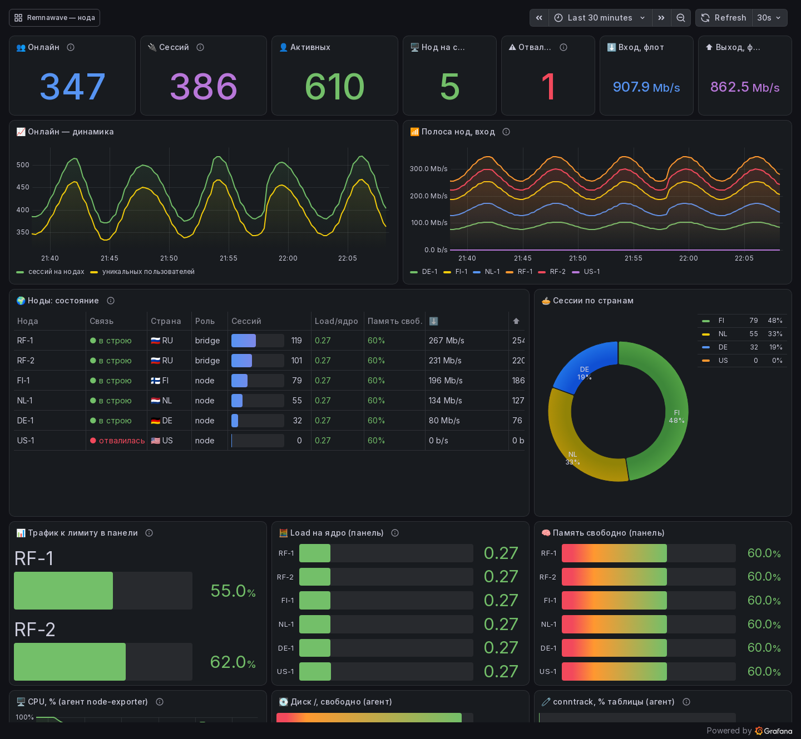

# remnawave-monitoring — мониторинг флота Remnawave и зашифрованные бэкапы

> Впервые? → **[Пошагово с нуля](docs/START-HERE.md)**. Боитесь за работающее? → **[Что стек делает и чего не делает](docs/SAFETY.md)**.
> Все команды, переменные, метрики, файлы → **[Справочник](docs/reference.md)**. Сервер умер → **[Восстановление](docs/RECOVERY.md)**.

Одна команда — и через пять минут у вас Grafana с флотом Remnawave, тревоги в Telegram, страница
статуса для клиентов и ночные зашифрованные бэкапы панели. Всё из стандартных компонентов
(Prometheus, Grafana, node-exporter, blackbox, Uptime Kuma, age), ничего в панели не меняется.



## Что внутри

| часть | что делает |
|---|---|
| **Экспортёр панели** `exporter/rw_exporter.py` | раз в 30 с читает панель (только чтение) и отдаёт Prometheus-метрики: онлайн и сессии, пользователи по статусам, по каждой ноде — связь, сессии, скорость, счётчики интерфейса «как у хостера», load и память, трафик к лимиту, версии xray/remnanode. Только стандартная библиотека Python |
| **Стек** `stack/` | docker compose: Prometheus (90 дней истории) + Grafana с двумя готовыми дашбордами и **11 правилами тревог → Telegram** + node-exporter + blackbox (порты нод и HTTPS панели) + Uptime Kuma (страница статуса) |
| **Цели из панели** `remnawave-monitoring targets` | список нод берётся из панели: агенты, порты инбаундов, HTTPS панели и подписки. Добавили ноду в панель — одна команда, и она в мониторинге |
| **Агент на ноды** `scripts/install-node-exporter.sh` | CPU, память, диск, conntrack, сеть каждой ноды; порт 9100 открывается **только серверу мониторинга** (ufw), при выключенном файрволе отказывается ставиться |
| **Uptime Kuma** `remnawave-monitoring kuma-sql` | мониторы портов всех нод и HTTPS из панели, Telegram, публичная страница статуса — одной командой |
| **Бэкапы** `backup/` | ночью: `pg_dump` панели + папка `/opt/remnawave` (и базы Kuma/Grafana на сервере мониторинга) → шифрование публичным ключом **age** → ротация → копия на другой сервер. Секретного ключа на серверах нет. `verify-restore.sh` проверяет, что копия восстанавливается; `restore-panel.sh` поднимает панель на новом сервере |

## Быстрый старт — одна команда

Сервер с Ubuntu 22.04/24.04 или Debian 12 (1 ядро / 1 ГБ хватит на десятки нод; Docker поставит сам),
доступ к панели по сети, отдельный Telegram-бот для тревог.

```bash
curl -fsSL https://raw.githubusercontent.com/ponoroshca/remnawave-monitoring/main/scripts/install.sh | sudo bash
```

Мастер спросит адрес панели и токен → проверит → придумает пароль Grafana → подключит Telegram
(получателя определит сам) → сгенерирует цели из нод панели → поднимет стек → проверит, что всё
отвечает, и напечатает адреса. Дальше:

```bash
remnawave-monitoring doctor      # чек-лист «всё ли работает»
remnawave-monitoring status      # онлайн, сессии, ноды — прямо в консоль
remnawave-monitoring targets     # добавили ноду в панель → обновить цели
remnawave-monitoring kuma-sql --apply   # мониторы и страница статуса в Kuma
```

Агент на каждую ноду (на самой ноде, IP — адрес сервера мониторинга, мастер его напечатает):

```bash
curl -fsSL https://raw.githubusercontent.com/ponoroshca/remnawave-monitoring/main/scripts/install-node-exporter.sh | sudo bash -s -- --allow-from 203.0.113.5
```

Бэкапы (на сервере панели; мастер сгенерирует ключ, покажет секретную часть один раз и сотрёт её с сервера):

```bash
curl -fsSL https://raw.githubusercontent.com/ponoroshca/remnawave-monitoring/main/backup/install-backup.sh | sudo bash
```

## Тревоги в Telegram

| правило | когда | порог |
|---|---|---|
| Нода отвалилась от панели | не на связи и не выключена в панели | 3 мин |
| Трафик ноды ≥ 80% лимита | лимит задан в панели | 5 мин |
| Нода перегружена | load1 / ядер > 0,9 (данные панели) | 15 мин |
| CPU > 85% · Память < 10% · Диск / < 10% · conntrack > 80% | по агенту node-exporter | 10 / 10 / 5 / 5 мин |
| Порт ноды не отвечает | TCP к порту инбаунда с сервера мониторинга | 3 мин |
| Панель или страница подписки не отвечает | HTTPS | 2 мин |
| Агент ноды не отвечает | node-exporter недоступен | 5 мин |
| Экспортёр не может опросить панель | токен отозван, панель лежит | 5 мин |

Сообщение: `🔴 Нода отвалилась от панели — FI-1 (FI) не на связи с панелью 3 минуты`, и `✅ снято:` когда
прошло. Пороги — в `stack/grafana/provisioning/alerting/rules.yml`, это обычный YAML.

## Что стек никогда не делает

Не меняет ничего в панели и на нодах: экспортёр только читает `/api/system/stats` и `/api/nodes`;
`targets` и `kuma-sql` тоже только читают. На нодах агент — один контейнер `node-exporter` и одно
правило ufw. Бэкапы читают базу через `pg_dump` (не блокирует панель) и не хранят секретный ключ.
Снять всё: `scripts/uninstall.sh`, `install-node-exporter.sh --uninstall`, `install-backup.sh --uninstall`.
Подробно — [docs/SAFETY.md](docs/SAFETY.md).

## Документация

- [Пошагово с нуля](docs/START-HERE.md) · [Безопасность](docs/SAFETY.md) · [Восстановление](docs/RECOVERY.md) · [Справочник](docs/reference.md) · [Вопросы](docs/faq.md)

Соседние проекты: [remnawave-bridge-guard](https://github.com/ponoroshca/remnawave-bridge-guard) —
проверка мостов настоящим клиентом и автопереключение; [remnawave-node-kit](https://github.com/ponoroshca/remnawave-node-kit) —
установка и тюнинг нод; [remnawave-fleet-guards](https://github.com/ponoroshca/remnawave-fleet-guards) —
сторожа нод и трафика без Grafana (Telegram-только).

## Лицензия

MIT. Как есть. В основе — стек, который с лета 2026 работает на живом флоте из нескольких десятков нод.
